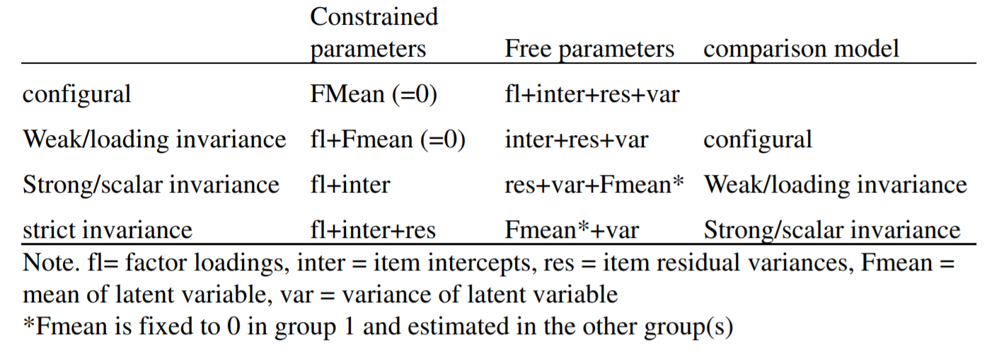

```{r setup, include = FALSE}
library("papaja")
r_refs("r-references.bib")
```

```{r analysis-preferences}
# Seed for random number generation
set.seed(42)
knitr::opts_chunk$set(cache.extra = knitr::rand_seed)
```

First emerging in the 1990's [@li1999impact], commercial online panel data (OPD) is more commonly encountered, although questions regarding data quality persist [@walter2019tale; ]. @walter2019tale did a meta-analysis

@porter2019use's qualitative review concluded with practical recomendations such as

The appeal is obvious - other than the financial obstacle, these OPD options bypass the so-called "courtship rituals" that are often (at least percieved to be) necessary when attempting to sample from organizational populations [e.g., @tracy2019qualitative]

Need help finding:

+ @walter2019tale

The roots of employee [aka work; e.g., @schaufeli_conceptualization_2010] engagement research likely started with theoretical expansions of forms of employee participation [see, for example, @ferris_added_1984] and job involvement [e.g., @elloy_examination_1991]. This exploration extended into broader considerations of attitudes and emotions [@staw_employee_1994] and were informed by further exploration of the dimensionality of constructs such as organizational commitment [@meyer_three-component_1991]. The 1990's saw focused development and refinement (for example, a dissertation; @leone_relation_1995 or actual semantic reference; @kahn_psychological_1990). @staw_employee_1994 investigated the relationships between *positive emotions* and favorable work outcomes, and although they do not use the word, "engagement", their distinction between felt and expressed emotion likely held influence upon the burgeoning interest in the engagement construct.

Clear in this history is the specification of engagement as a work *attitude*.


Although occasionally referred to as residing on the opposing pole to *burnout* [@maslach_early_2008], these two constructs are currently most commonly conceptualized as being distinct [@timms2012burnt; @kim_burnout_2009; @goering2017not; @schaufeli2008workaholism], although certainly not universally [@cole2012job; @taris2017burnout]. Comparing the two, @goering2017not concluded that they have a moderate (negative) association, but also distinct nomological networks. @schaufeli2008workaholism investigated both internal and external association indicators, concluding that engagement and burnout (as well as *workaholism*) should be considered three distinct constructs. 

Burnout can be defined as a psychological syndrome characterized by exhaustion (low energy), cynicism (low involvement), and inefficacy (low self-efficacy), which is experienced in response to chronic job stressors [e.g., @leiter_areas_2004; @maslach1997causes]. Alternatively, engagement refers to an individual worker's involvement and satisfaction as well as enthusiasm for work [@harter_business-unit-level_2002]. @schaufeli_uwesutrecht_2003 further specify a "positive, fulfilling, work-related state of mind that is characterized by vigor, dedication, and absorption" (p. 74). Via their conceptualization, vigor is described as high levels of energy and mental resilience while working. Dedication refers to being strongly involved in one's work and experiencing a sense of significance, enthusiasm, inspiration, pride, and challenge. Absorption is characterized by being fully concentrated and happily engrossed in one's work, whereby time passes quickly and one has difficulties with detaching oneself from work [@schaufeli_measurement_2002]. The dimension of absorption has been noted as being influenced in conceptual specification by [@csikszentmihalyi1990flow]'s concept of "flow".

Regarding measurement, Gallup is widely acknowledged as an early pioneer in the measurement of the construct [see, for example, @coffman_hard_1999]. The Utrecht Work Engagement Scale (UWES) is another self-report questionnaire developed by @schaufeli_uwesutrecht_2003 that directly assesses the vigor, dedication, and absorption elements.

## Attitudes 

> TRIPARTITE MODEL--work here

The first, to our knowledge, use of the word "engagement" as a construct came in @kahn1990psychological, defining it as: "the harnessing of organization members' selves to their work roles; in engagement, people employ and express themselves physically, cognitively, and emotionally during role performances." Although this definition was quickly bypassed by subsequent papers (see, for example, [@baumruk2004missing] and [@shaw2005engagement], who framed it in terms of one's cognitive and affective *commitment* to one's organization), @kahn1990psychological's definition is notable in that it conforms to the then-ascendant tripartite model of attitudes proposed by @rosenberg_cognitive_1960. This model frames attitudes as latent variables that manifest cognitively, affectively and behaviorally.

Although falling out of favor in the decades following its construction, interest in the tripartite model was revived by @kaiser_campbell_2019,

## Item order as a multidimensional assessment response cues

Response cues in general and order effects in particular have their root in Cognitive Psychology, with the bulk of studies occurring in the early days of Cognitive Psychology (e.g., the 1960's on). Primacy and recency (whether an item is presented at the beginning or end of a list) are known to elicit differences in response [e.g., @krosnick1987evaluation]. This effect has also been noted in methodological contexts in the form of differential carryover effects. For example, the order of presentation of samples in a product taste test [see, for example, @dean1980presentation]. @ackerman1989comparison found only small differences in response patterns when presenting *test* items in a fixed versus random ordering. @mashburn2014effect experimentally controlled the presentation of rated material, finding higher indices of reliability and validity of ratings when content was administered randomly (e.g., order effects were controlled for).

@knowles1988item and @hamilton1990self both administered exhaustively crossed orderings of items, noting better item discrimination (e.g., corrected item-total correlations) *later* in the assessment, regardless of actual item content. @steinberg1994context provides a description of this effect: "...literature converges on the view that responding repeatedly to items representing a single, unidimensional psychological construct increases the accessibility of relevant beliefs or feelings, which in turn, increases the relation between the item resopnse and the underlying construct." (p. 341) This statement could be rephrased as: location serves as a response cue. "This attentional focus influences item responses through such processes as item interpretation and ease of retrieval of relevant feelings that are applied to the item" [@steinberg1994context, p. 341]. 

@steinberg1994context looked at order effects in personality measurement, 

>Weinberg, M. K., Seton, C., & Cameron, N. (2018). The Measurement of Subjective Wellbeing: Item-Order Effects in the Personal Wellbeing Index—Adult. Journal of Happiness Studies, 19(1), 315–332. https://doi-org.ezproxy.montclair.edu/10.1007/s10902-016-9822-1

@Weinberg2018 examine the effects of randomized items and domains in the Personal Wellbeing Index (PWI) in measure subjective wellbeing (SWB). @Weinberg2018 conduct two studies one, looking at the PWI comparing its usual general-specific format to a modified format, furthermore, the order of the domain items will stay the same, while the general items will be random in question order. In the second study, @Weinberg2018 randomized the domain items while the general items will be the same to standard scale order. In @Weinberg2018, study 1 showed no results between general specific format and the modified format, however in study 2, they did find that presenting the random order effects did have lower means, then fixed order effects. @Weinberg2018 present many different reasons for this outcomes, which could be those in the random order effect group had more participant experiencing high levels of wellbeing, and the other explanation is that changing order of items of PWI could affect the score. @Weinberg2018 conducted a multiple regression analysis which showed that random order group account for 9% more variance in GLS than the fixed order group and conducted a confirmatory factor analysis showing that the fixed order groups was not a good model fit. 

@serico2021 looked at item order effects in self-report measures of aggression perpetration and victimization. @serico2021 provides a descriptions of two general biases in self-report measures, which are the subject's biases, and bias in wording, order, or format of items in the measure. In previous studies, there was an item order effect and item group effect in the measure that shows participants' response and psychometric properties of an aggression measure. # citation from other articles (Dietz & Jasinski, 2007; Shorey, Woods, & Cornelius, 2016). ######### In @serico2021, the findings shows that there is an item order affect in the reported frequency of aggression perpetration. It shows that item order can influence a person self-report in aggression perpetration and victimization, showing that there are methodological issue that have to be consider when developing and utilizing measure of aggression and victimization. This methodological issues can still be applicable to other measure such as workplace engagement, since we also look at people's behaviors, cognitive, and emotions.

This model is not without criticism, however. Some critics question its structural validity by pointing out that vigor, dedication and absorption all correlate highly with each other [@kulikowski2017we].

The present article explores two methods for constructing a scale that incorporates both the substantive and attitudinal models into one, a more classical one based on corrected item-total correlations and one based on modification indices.

Existing measures include @soane2012development

Our conceptualization of work engagement is a mental state wherein employees: a) feel energized (*Vigor*), b) are enthusiastic about the content of their work and the things they do (*Dedication*), and c) are so immersed in their work activities that time seems compressed (*Absorption*). We further decompose each of these facets into three attitudinal components: d) feeling (e.g., affect), e) thought (e.g., cognition), and f) action (e.g., behavior). Development and construct validation of the focal 18-item measure of engagement is described in @engage_2022 whereas the current study on administrative response cues in the form of order of item presentation. The expectation is that either model (attitudinal or substantive) will exhibit stronger factorial validity when item administration parallels latent structure.

# Methods


## Participants

Data was obtained from two sources. In the first sampling, 282 individuals responded to a snowball sampling initiated by Industrial and Organizational Psychology faculty and graduate students. There were four counterbalanced orderings of item presentations within this administration, as well as an additional 18 contextual items - this sample constituted the original scale development sample, and at the time of administration the additional contextual items were candidates for item retention. In the second data collection initiative, Qualtrics panels were solicited along with 2 additional contextual items. These respondents included 343 working adults who responded to attitudinally clustered items and 404 working adults who responded to substantively clustered items.

## Materials

Our 18-item engagement measure was crafted to be intentionally complex (each item is intended to load on two constructs). This complexity, however, derives from a crossing of the attitudinal components of affect, cognition, and behavior with the substantive engagement components of vigor, dedication, and absorption. Within the current investigation, we realized $\alpha$'s of  (Absorption),  (Dedication),  (Vigor),  (Affect),  (Cognition), and  (Behavior). The 6-point response scale is: Strongly Disagree, Disagree, Somewhat Disagree, Somewhat Agree, Agree, Strongly Agree. The item stems as well as their scale assocation are presented in Table XX. 

# Results

We used `r cite_r("r-references.bib")` for all our analyses.

The omnibus CFA's, regardless of item ordering, across  respondents showed fair fit for both the substantive ($\chi^2_{substantive}$=, *df*=, *RMSEA*=) as well as attitudinal structures ($\chi^2_{attitudinal}$=, *df*=, *RMSEA*=). Additional fit indices for the two models are presented in Table XX. Figures 1 and 2 present the omnibus models visually (standardized coefficients displayed). Note that the primary source of misfit for both models within the omnibus analysis is item 14, which is the lone reverse-coded item within the inventory, "Thinking about work saps my energy".

### Condition effects

The order of item presentation was: 1) random within substantive dimension, 2) random within attitudinal dimension, 3) parcels of substantive within attitudinal (36-item attitudinal context), 4) parcels of attitudinal within substantive (36-item substantive context), 5) parcels of substantive within attitudinal (20-item attitudinal context), and 6) parcels of attitudinal within substantive (20-item substantive context). For example, in condition 1, the first items presented were all associated with one attitudinal dimension (for example, "Affect"). Once the Affect item list was fully exhausted, the respondent was then administered the full set of Behavioral items, and once these were completed the respondent was then administered the Cognitive item set[^yaddup].  We view these orderings as cues regarding factor structure, and anticipated empirical factor structures to reflect these cues. The effects did emerge, but were quite moderate (for example, $\Delta{\chi^2_{Cond1}}$ = 9.55, $\Delta{AIC_{Cond1}}$ = 10.53). Given the variety of item orderings administered, this should be considered somewhat comforting regarding the effect of contextual embeddedness within multidimensional inventories. To further explore degree of similarity, we applied explicit tests of measurement invariance. 

[^yaddup]: Across conditions, the order of presentation of item "blocks" was also randomized. For example, not all respondents in Condition 1 was administered the Affect item block first - roughly 1/3 was presented the Behavioral block first and roughly 1/3 was presented the Cognitive block first.

#### Measurement invariance

Because our six conditions were obtained across two different sampling procedures, we apply our analyses of measurement invariance twice - first investigating the four conditions administered within our initial snowball sampling and then secondly also extending to the follow-up Qualtrics panel respondents. 

We looked at structural invariance as well as latent means [@steinmetz2009testing; @meredith1993measurement]. 

```{r figure1, fig.cap="Steps for measurement invariance (as recommended by Xu, 2012)."}



```


# Discussion

The item cues did provide slight response cues (attending to individual model fit indices), however, the effect was quite small. Measurement invariance is plausible within our initial four administration conditions, although it is not attained across all six conditions. This is possibly attributable to differences in sampled population (in addition to the possibility that this difference is attributable to item orderings),

\newpage

# References

```{=tex}
\begingroup
\setlength{\parindent}{-0.5in}
\setlength{\leftskip}{0.5in}
```
::: {#refs custom-style="Bibliography"}
:::

\endgroup
